<h1>Ramen and Sushi Bar</h1>

Logo: meaning authentic and tasty in Japanese

Ramen and Sushi Bar is a full-stack project that enables user to make order on three types of Japanese food products: Ramen, Sushi, and drink and reserve table for meal.

<h2>How to Make Order</h2>

<li>User will need to sign in or register first, then they can navigate to Ramen, Sushi and Drink page and make their order after clicking into the dropdown menu. It will lead them to the menu and a form for them to make their order.</li>

<h3>Sign In page</h3>

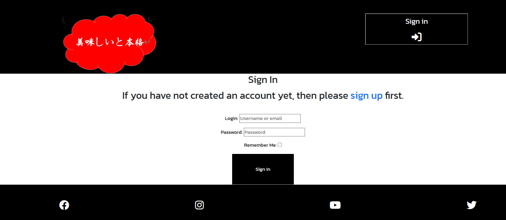

<h3>Sign Up page</h3>

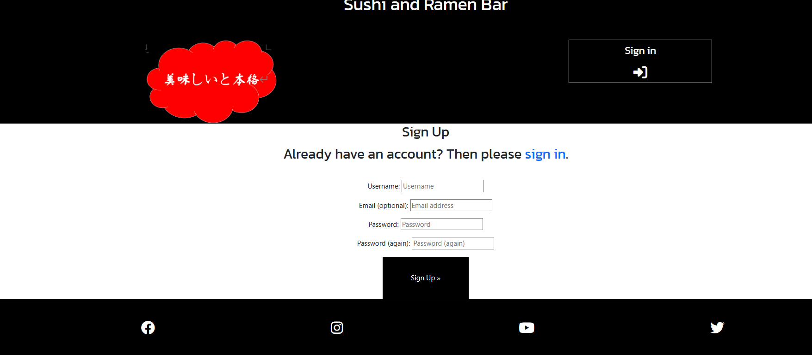

<h3>Dropdown menu at home page</h3>

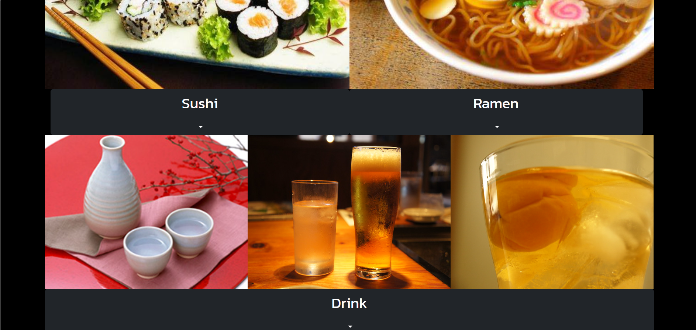

<h3>Ramen Menu</h3>

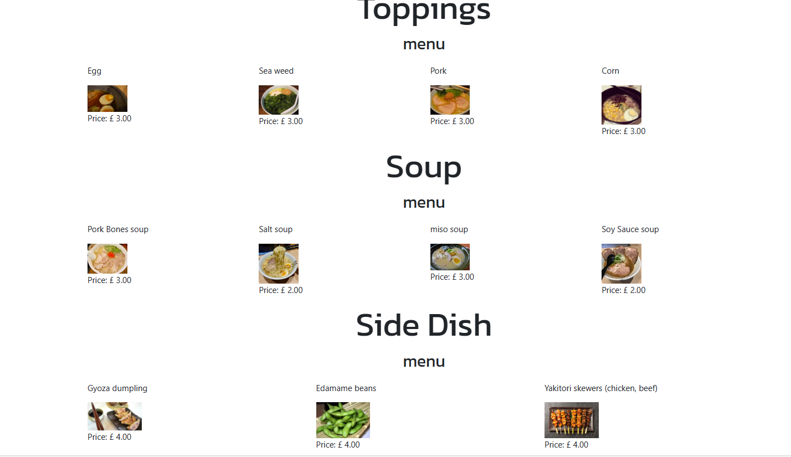

<h3>Ramen order form</h3>

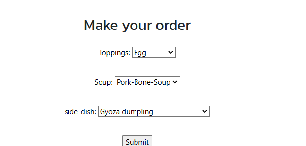

 
 
<li>User can choose their own topping, soup choice, and side dish of their ramen.</li>

<h3>Sushi Menu</h3>

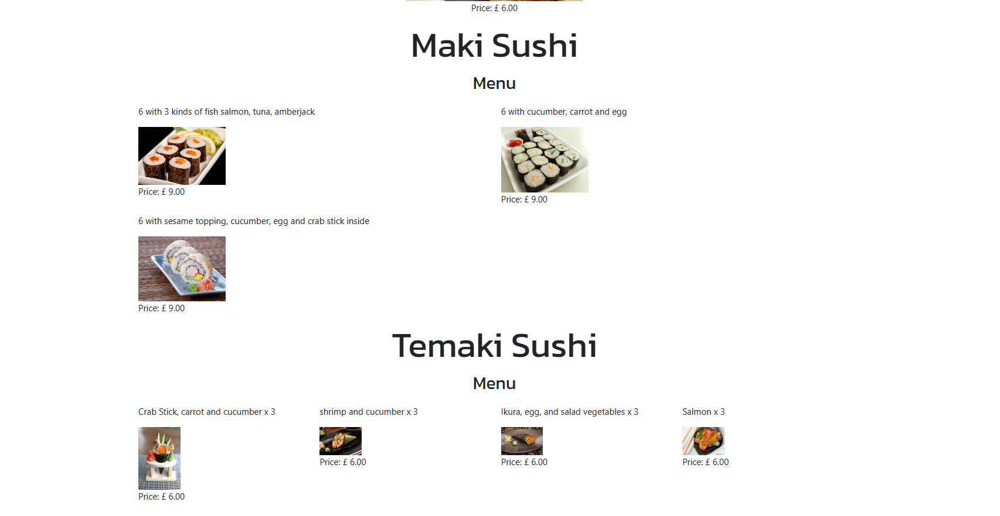

<h3>Sushi order form</h3>

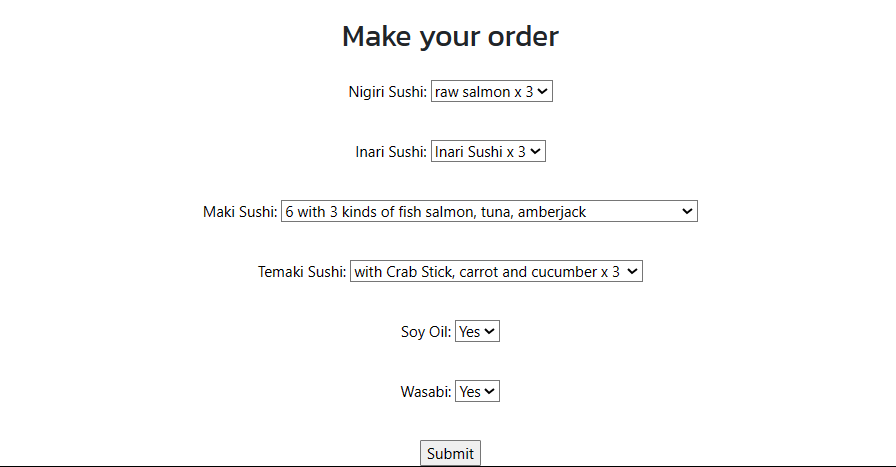

 
 
<li>User can choose different types of sushi such as nigiri, inari, maki, temaki, we also offer wasabi and soy oil.</li>

<h3>Drink Menu</h3>

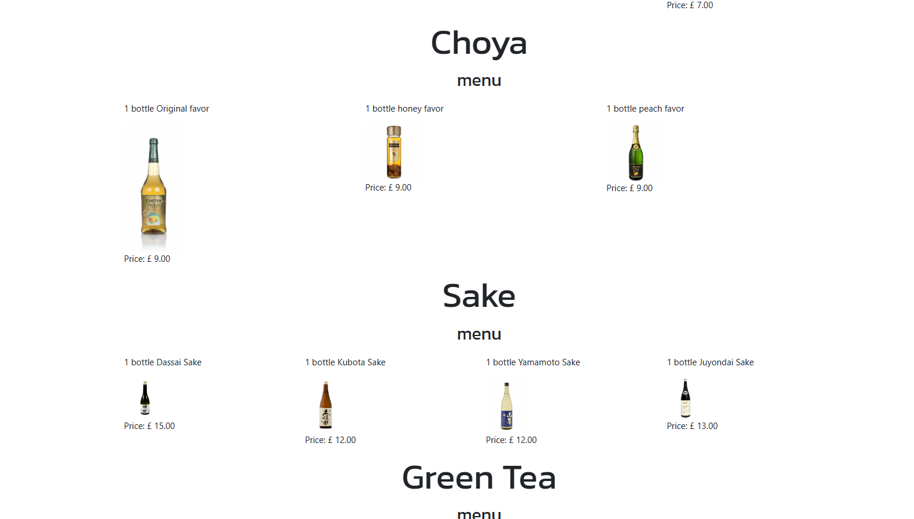

<h3>Drink order form</h3>

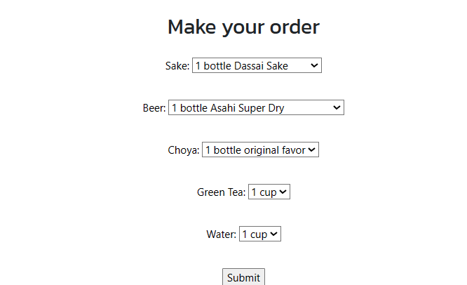
 
 
<li>User can choose different brands of beer, sake, choya for wine and green tea and water as well.</li>

<h2>How to Check Order</h2>

<li>User can click on the "Confirm Order" button at the top right corner of the page to view and amend orders at the order.html page.</li>

<h3>Confirm Order button</h3>

<h2>How to Reserve Booking</h2>
<li>User can reserve booking by filling the reservation form at the bottom of the order page.</li>
<li>It will collect the user's name, email, date of visiting, time of arrival, number of people visiting and email.</li>
<li>After submitting the booking form, the order form will be cleaned and user can submit another order after that.</li>

<h3>Confirm booking form</h3>

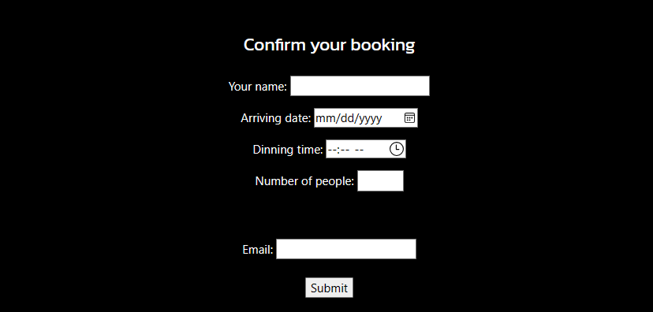

<h2>How to Edit Order</h2>
<li>User can edit order by clicking the edit button in order page which is below each item order. After clicking it will redirect user to the respective product (Ramen/Sushi/Drink) to change their order.</li>

<li>User can confirm the order(s) has been changed by clicking the confirm order button again.</li>

<h2>How to Delete Order</h2>
<li>User can delete order by clicking the delete button in order page which is below each item order. After clicking it will redirect user to the respective product menu (Ramen/Sushi/Drink).</li>

<li>User can confirm the order(s) has been deleted by clicking the confirm order button again.</li>

<h3>Edit and Delete order button for each product in order page</h3>

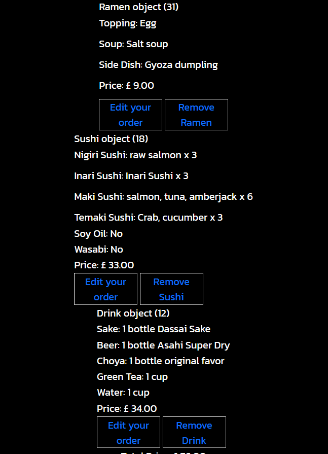

<h2>Development</h2>
<h3> Original Flowchart and Wireframe</h3>

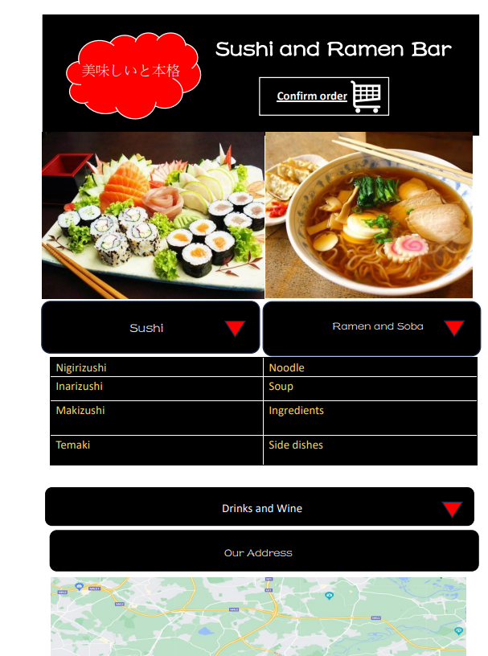
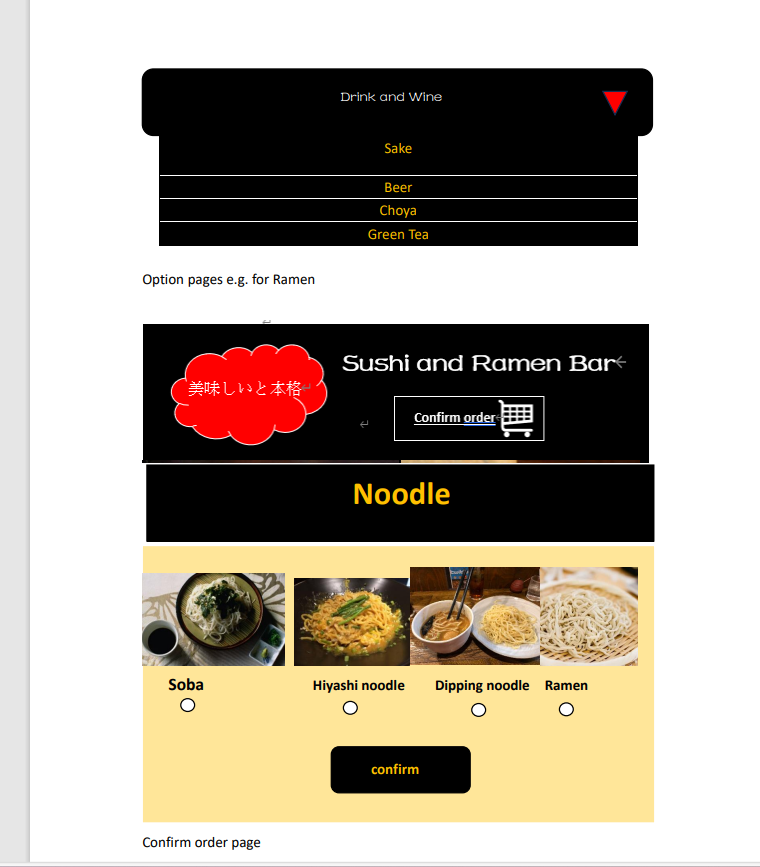
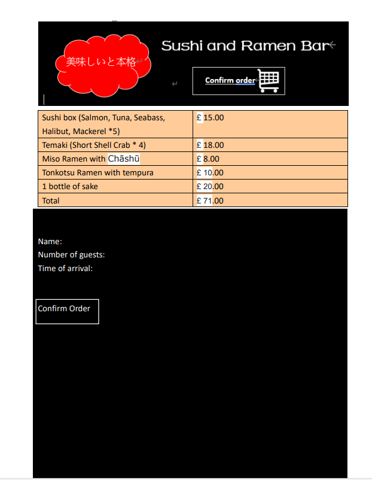

<li>In my original setting, I would like to offer user choices in choosing the soup, side_dish and noodles for ramen options and different types of sushi in the same form.</li>
<li>After doing more research and building the page, I realise that it would be too complicated so I simplified the number of options for users to choose.</li>
<li>I have also added a login and sign off function using django allauth functionality.</li>

<h3>Agile approach in development </h3>

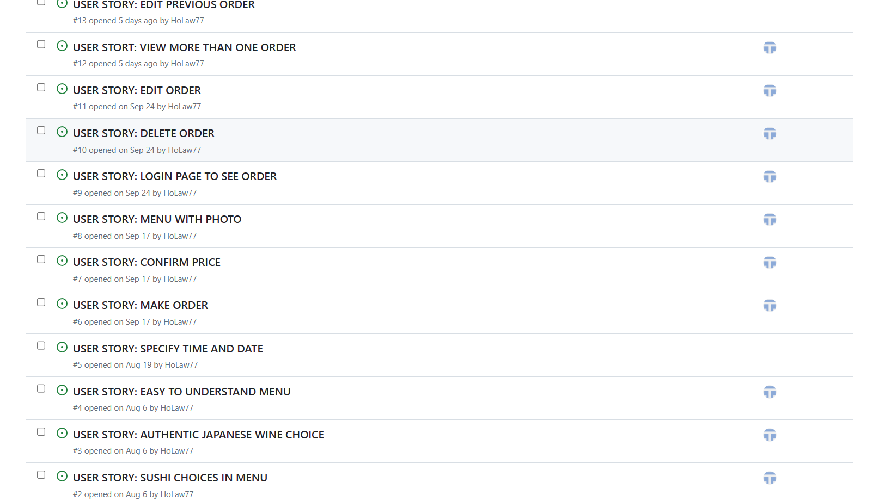

<li>I have follow the agile approach in this project by setting up various issues to improve my project throughout the development process</li>
<li>For example, I have added food photoes and amended the menu into more customer-friendly so that the customer can order the food easily even they don't understand Japanese.</li>

<h2>Testing</h2>
<li>I tested that this page works in different browser such as: Chrome, Microsoft-edge, Firefox.</li>
<li>I confirmed the project is responsive, look goods and function on all standard size screen using devtool device tool bar.</li>
<li>Code tested in my local terminal and confirmed using coverage.</li>

<h2>Bugs</h2>

<h3>Solving bugs</h3>

<li>When I tried to build the confirm order button, I realise that the order rendered in the order.html have to be manually added by admin through admin panel. After checking on the Foreign Key field and discussing with my mentor, I learn about it is necessary to use the @property method to store the fields in Ramen, Sushi and Drink model in order to make them accessible in Order model.</li>

<li>When I am building the order.html and the view_order.html, I cannot render the order from the database. After checking with tutor, I realise the problem is in the url.py and views.py where my class view with the same url name 'order' execute before the confirm_order views, so I amended the url and it works.</li>
<li>When I am running test in test_model.py, some of my tests passed but the coverage report did not reflect that, after checking, I use the command coverage run --source=order manage.py test which reflects the test coverage report correctly.</li>

<h2>Validation Testing</h2>
<li>HTML: No error was found using official W3C Validator.</li>
<li>CSS: No error was found using official W3C Validator.</li>
<li>Accesssibility: I confirm the design and layout of the page is easy to read and accessible by running it through lighthouse in devtools.
</li>

<h2>Deployment</h2>

The page is deployed using heroku, following the below steps:

<li> Install the heroku CLI in IDE terminal</li>
<li>Install Project requirements app </li>
<li>Create the heroku app</li>
<li>Create a database in ElephantSQL</li>
<li>Connecting our Remote Database</li>
<li>Pushing changes to Github</li>
<li>Fix ALLOWED_HOSTS and Run the Project</li>
<li>Connecting Heroku to Github</li>
<li>Set The SECRET_KEY in setting.py</li>
<li>Once the link is deployed, the link is generated</li>

The link is below

<h2>Credit</h2>

<h3>Code</h3>

<li>Model structure has been advised by my mentor Aleksei Konovalov. Many Thanks for his patient and helpful guidance.</li>

<li>view order template and view is inspired by handout of Hello Django project in Code Institute course.

[Hello Django: Part 6: Rendering a Create New Item page](https://docs.google.com/document/d/1P5Mzkvzm3HUMrMgABn1KwU_pHnR5n4TUX8rHKB-9CMA/edit)
</li>

<li>Edit and delete order button is inspired by the handout of Hello Django project in Code Institute course

[Hello Django: Part 7: Modifying Data](https://docs.google.com/document/d/1RNDHMuQEBJ8if9XYR1WLjNJx_Z4Nad-NarjRVFrC0gQ/edit#heading=h.hvy9tw74f1o0)
</li>

<li>testing format has been inspired by handout of Hello Django project in Code Institute modules

[Hello Django: Part 8: Testing](https://docs.google.com/document/d/1L7zyIXL1wCki2eOoDZPCw9fIIe93NfdCiA_mbht9P8A/edit#heading=h.hvy9tw74f1o0)

</li>

<h3>Media</h3>

<h4>Index.html</h4>

https://www.pinterest.com/pin/292593307016180845/

https://aminoapps.com/c/anime/page/blog/anime-foodies-ramen-edition/88tm_u2Qd3RomKew1xx84JKnvaX1pjSR

https://www.pinterest.com/pin/242420392411838311/

https://tokyocheapo.com/food-and-drink/drinking/tokyo-beer-garden-bets/

https://www.pinterest.com/pin/221731981643225578/

https://www.publicdomainpictures.net/en/view-image.php?image=118342&picture=japanese-pattern-background

<h4>ramen.html</h4>

https://www.flickr.com/photos/o_0/41785994071

https://www.flickr.com/photos/95268887@N00/2392523070

https://www.flickr.com/photos/huixuan/1350811859/

https://www.pinterest.com/pin/266275396692800295/

https://pleasurepalate.blogspot.com/2009/02/im-in-mood-for-soup.html

https://www.flickr.com/photos/62942199@N08/48023829601/

https://www.flickr.com/photos/mmm-yoso/44764296142/

https://www.flickr.com/photos/62942199@N08/33497523872

https://www.recetasjaponesas.com/2015/05/gyoza.html

https://www.kampustani.com/teknologi-penanganan-pasca-panen-kedelai/

https://www.dream.co.id/culinary/resep-yakitori-sate-kulit-ayam-manis-ala-jepang-200625r.html

https://dude4food.blogspot.com/2016/11/a-tenya-christmas-with-tenya-tempura.html

https://www.angsarap.net/2014/10/28/kimchi/

https://michaeltoa.com/japanese-fried-chicken-chicken-karaage-5c52c05e4805?gi=3f92a80ddfa5

<h4>sushi.html</h4>

https://chapucillasycocinillas.blogspot.com/2017/08/nigiri-sushi-de-salmon.html

https://www.isaaa.org/kc/cropbiotechupdate/article/default.asp?ID=18073

https://www.flickr.com/photos/cola21/4616907994/

https://www.bloggang.com/mainblog.php?id=tsuki-luna&month=13-06-2012&group=3&gblog=5

https://www.flickr.com/photos/avlxyz/37363714656

https://mmm-yoso.typepad.com/mmmyoso/2019/09/kotobuki-its-rr-week.html

https://www.pinterest.com/pin/393079873713213846/

https://www.pinterest.com/pin/393079873713213846/

http://cheapartyconsejosparafiestasbaratas.blogspot.com/2013/03/ideas-para-preparar-recetas-y-cocteles.html

https://www.angsarap.net/2011/11/02/california-roll/

https://www.pinterest.com/pin/324329610635242432/

https://pt.dreamstime.com/sushi-de-temaki-do-camar%C3%A3o-image109618376

https://medicinachinesabr.com.br/temakidesalmaoepepino/temaki-de-ikura-nori-arroz-ikura-ovas-de-salmao-e-pepino-r-3000-unid-2-jpg/

https://www.pinterest.com/pin/397513104600081200/

https://sushipoint.it/come-usare-la-salsa-di-soia-con-il-sushi

https://sushipoint.it/come-usare-la-salsa-di-soia-con-il-sushi

<h4>drink.html</h4>

https://www.bbfoodservice.co.uk/product/575086-1

https://fareastgizmos.com/other_stuff/sapporo_breweries_offers_worlds_first_beer_made_from_barley_grown_in_outer_space.php

https://www.thewineemporium.com.au/

https://www.mtcsake.com/beer/orion

https://www.masterofmalt.com/liqueurs/choya/choya-original-ume-fruit-liqueur/

https://www.drinksupermarket.com/choya-royal-honey-umeshu-70cl

http://intercooperation.hu/fogyasztasi-cikkek/fogyasztasicikkek/choya-original-sparkling-umeshu/

https://www.souschef.co.uk/products/dassai-45-sake?variant=30593385627706&utm_medium=cpc&utm_source=bing&utm_campaign=[VS]%20-%20(SC)%20Ingredients&utm_term=4581733688468402&utm_content(SC)%20Ingredients

https://www.whiskimen.com/product/%e4%b9%85%e4%bf%9d%e7%94%b0-%e5%8d%83%e5%a3%bd-%e5%90%9f%e9%87%80/

https://www.sakaya-kurihara.jp/item/2015ho-886/

https://xn--cesu66k.net/introduce/tosashiragiku/

https://www.flickr.com/photos/iirraa/218063307

https://commons.wikimedia.org/wiki/File:Glass-of-water.jpg

{::ignore rule="MD033"}