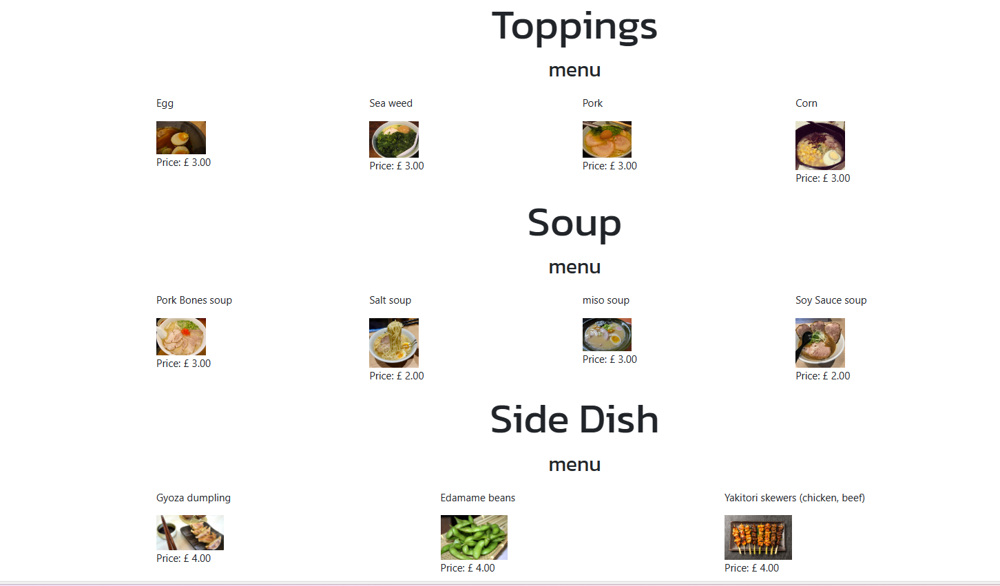
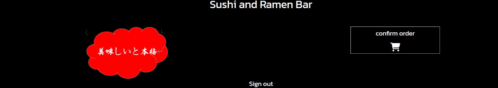

<h1>Ramen and Sushi Bar</h1>

Ramen and Sushi Bar is a full-stack project that enables user to make order on three types of Japanese food products: Ramen, Sushi, and drink and reserve table for meal.

<h2>How to Make Order</h2>

User will need to sign in or register first, then they can navigate to Ramen, Sushi and Drink and make their order after clicking into the dropdown menu. It will lead them to the menu and a form form them to make their order.

<h3>Sign In page</h3>

<h3>Sign Up page</h3>

<h3>Dropdown menu at home page</h3>

<h3>Ramen Menu</h3>

<h3>Ramen order form</h3>

 
 

User can choose their own topping, soup choice, and side dish of their ramen.

<h3>Sushi Menu</h3>

<h3>Sushi order form</h3>

 
 

User can choose different types of sushi such as nigiri, inari, maki, temaki, we also offer wasabi and soy oil.

<h3>Drink Menu</h3>

<h3>Drink order form</h3>

 
 

User can choose different brands of beer, sake, choya for wine and green tea dnd water as well.

<h2>How to Check Order</h2>

User can click on the "Confirm Order" button at the top right corner of the page

User can also view and amend previous others at the bottom of the order.html page by pressing the "View all orders" button

<h3>Confirm Order button</h3>

<h3>View all orders button </h3>

<h2>How to Reserve Booking</h2>

User can reserve booking by filling the reservation form at the bottom of the order page.

It will collect the users' name, email, date of visiting, time of arrival, number of people and email.

<h3>Confirm booking form</h3>

<h2>How to Edit Order</h2>

User can edit order by clicking the edit button in order page which is below each item order. After clicking it will redirect user to the respective product (Ramen/Sushi/Drink) to change their order.

User can confirm the order(s) has been changed by clicking the confirm order button again.

<h2>How to Delete Order</h2>

User can edit order by clicking the delete button in order page which is below each item order. After clicking it will redirect user to the respective product menu (Ramen/Sushi/Drink).

User can confirm the order(s) has been deleted by clicking the confirm order button again.

<h3>Edit and Delete order button for each product in order page</h3>

<h2>Development</h2>
<h3> Original Flowchart and Wireframe</h3>

![flow_chart]

In my original setting, I would like to offer user choices in choosing the soup, side_dish and noodles for ramen options and different types of sushi in the same form.

After doing more research and building the page, I realise that it would be too complicated so I simplified the number of options for users to choose.

I have also added a login and sign off function using django allauth functionality.

<h2>Testing</h2>

I tested that this page works in different browser such as: Chrome, Microsoft-edge, Firefox.

I confirmed the project is responsive, look goods and function on all standard size screen using devtool device tool bar.

<h2>Bugs</h2>

<h2>Validation Testing</h2>
<li>***HTML: No error was found using official W3C Validator.</li>
<li>CSS: No error was found using official W3C Validator.</li>
<li>Accesssibility: I confirm the design and layout of the page is easy to read and accessible by running it through lighthouse in devtools.
</li>

<h2>Deployment</h2>

<h2>Credit</h2>

<h3>Code</h3>

<h3>Media</h3>

{::ignore rule="MD033"}